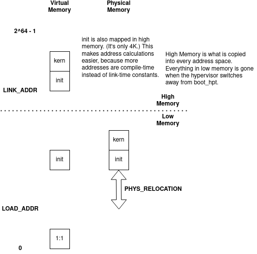

# Hedron: Implementation Details

The purpose of this document is to describe the implementation of the
Hedron microhypervisor. This document is meant for the person hacking on
Hedron source code. It's not meant as user documentation.

## Initialization Flow

Hedron shares much of its initialization flow between initial boot-up
and resume (as in ACPI sleep states).

All entry points are located in `src/start.S`. `__start_bsp` is the
initial entry point of the whole microhypervisor. `__resume_bsp` is
called on a resume from ACPI sleep states. They start the boostrap
processor (BSP). `__start_cpu` is the 16-bit entry point to bootstrap
CPUs. It is called during initial boot to bring up additional
application processors (APs) by calling into `__start_all`. On resume,
`__start_cpu` is configured to call first into `__resume_bsp` and then
into `__start_all`.

The `boot_lock` spin lock serializes most of the initialization of the
processors. This spin lock is necessary, because early during boot all
processors boot on the same stack and and access the same data
structures. For the BSP, `boot_lock` starts out locked and is released
once the APs have started. Then one AP at a time manages to grab the
`boot_lock` and proceeds through its initialization before it releases
it. Then the next AP configures itself.

Finally, all processors end up at a barrier and wait until all
processors have checked in. When the barrier releases all processors,
the kernel configures the TSC on each processor.

Finally, each processor calls `schedule()` and normal operation can
begin.

```mermaid
graph TD
  A[__start_bsp] --> B[__start_all]
  B -->|if BSP| C["init()"]
  C --> D["setup_cpulocal()"]
  D --> E["bootstrap()"]
  E -->|if BSP| F[start APs]
  F -->|release boot_lock| G[barrier]
  G -->|set TSC| H["schedule()"]

  A2[__start_cpu] --> B
  B -->|if AP, grab boot_lock| D
  E -->|if AP, release boot_lock| G

  A3[__resume_bsp] --> D
  D --> |if resume| E3["resume_bsp()"]
  E3 --> E
```

## The Boot Page Table

The hypervisor supports booting via Multiboot, version 1 and 2. In
both cases, execution starts at `__start_bsp` in 32-bit Protected Mode
without paging enabled.

We allow Multiboot 2 loaders to relocate the hypervisor in physical
memory. Because paging is not enabled, this means that on boot the
hypervisor executes at an initially unknown location. This is
inconvenient, because 32-bit code doesn't support instruction pointer
relative addressing.

To create the boot page table, we use statically allocated memory (see
the linker script). We first create a 2 MiB 1:1 mapping for the
initialization code. This is just used to enable paging and 64-bit
mode and be able to jump into high memory.

We also create a 2 MiB 1:1 mapping at address 0 to facilitate 16-bit
code execution. This is needed to boot APs and boot the BSP after
resume. See the initialization flow above.

Finally, we map the whole hypervisor image again at `LINK_ADDR`. This
is the part of the address space that will be re-used for all future
page tables that are created.

## Read-Copy Update (RCU)

... write me ...

## Kernel Memory Layout

... write me ...

## Page Table Management

... write me ...
